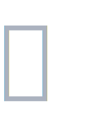

[](https://github.com/ACP-CODE/astro-favicons/actions/workflows/ci.yaml)
[](https://www.npmjs.com/package/astro-favicons)

[W3C]: https://www.w3.org/TR/appmanifest/#x_localized-members
[JSDoc]: ./dist/index.d.ts
[documentation]: ./dist/index.d.ts
[Github]: https://github.com/withpwa/astro/issues
[Releases]: https://github.com/ACP-CODE/astro-favicons/releases/

<div align="center">
  


# astro-favicons

An all-in-one favicon and PWA assets generator for Astro projects, <br>
supporting iOS 13+, Android, Windows, macOS, chromeOS, and all major browsers (Chrome, Safari, Firefox, Yandex, IE, Edge).

Supports localized app names, and integrates a dynamic [W3C] appmanifest, and supports hot reloading for efficient development.

</div>

## Installation

Quickly install with the `astro add` command: (>=4.0.0)

```shell
npx astro add astro-favicons
```

If you run into issues, try with [Manual Setup](#1-install-and-configure) guide.

## Documentation

<details><summary>✨ Manual Setup</summary>

### 1. Install and Configure

- **Step 1**: To install manually, run:

  ```shell
  npm install astro-favicons
  ```

- **Step 2**: Add the integration to your Astro config file (`astro.config.*`):

```ts
// @ts-check
import { defineConfig } from "astro/config";
import favicons from "astro-favicons";

export default defineConfig({
  integrations: [favicons()],
});
```

- **Step 3**: Place the `favicon.svg` file in the `public` folder:

  ```plaintext
  /
  ├── public/
  │   └── favicon.svg
  ├── src/
  │   └── pages/
  │       └── index.astro
  └── astro.config.mjs
  ```

### 2. Development

Start the server with `npm run dev`, You can access the all generated assets, such as `http://localhost:4321/manifest.webmanifest`.

By default, `astro-favicons` will insert 20 HTML tags into all pages, including the `default404` page:

<details>
<summary><b>Automatically Injected HTML Tags (Localized Support)</b></summary>

```html
<link rel="manifest" href="/manifest.webmanifest" />
<meta name="mobile-web-app-capable" content="yes" />
<meta name="theme-color" media="(prefers-color-scheme: light)" content="#fff" />
<meta name="theme-color" media="(prefers-color-scheme: dark)" content="#000" />
<meta name="application-name" content="Astro Favicons" />
<link rel="apple-touch-icon" sizes="180x180" href="/apple-touch-icon.png" />
<link
  rel="apple-touch-icon"
  sizes="180x180"
  href="/apple-touch-icon-precomposed.png"
/>
<link rel="mask-icon" href="/safari-pinned-tab.svg" color="#fff" />
<meta name="apple-mobile-web-app-capable" content="yes" />
<meta
  name="apple-mobile-web-app-status-bar-style"
  content="black-translucent"
/>
<meta name="apple-mobile-web-app-title" content="Astro Favicons" />
<link rel="icon" type="image/x-icon" href="/favicon.ico" />
<link rel="icon" type="image/png" sizes="16x16" href="/favicon-16x16.png" />
<link rel="icon" type="image/png" sizes="32x32" href="/favicon-32x32.png" />
<link rel="icon" type="image/png" sizes="48x48" href="/favicon-48x48.png" />
<link rel="icon" type="image/svg+xml" href="/favicon.svg" />
<meta name="msapplication-TileColor" content="#fff" />
<meta name="msapplication-TileImage" content="/mstile-144x144.png" />
<meta name="msapplication-config" content="/browserconfig.xml" />
<link rel="yandex-tableau-widget" href="/yandex-browser-manifest.json" />
```

</details>

> - **`Localized`** (requires `name_localized` configuration).
> - **`Capo.js`** rule is enabled by default. If you don't want `<head>` tags to be ordered automatically, you can disable it by setting the relevant option to `false`.

### 3. Build

Build the project by running `npm run build`. By default, 3 files and 16 images will be built through `emitFile` of vite.

<details><summary><b>Build Output: 19 Files</b></summary>

```shell
17:57:14 [vite] dist/yandex-browser-manifest.json       0.15 kB │ gzip: 0.13 kB
17:57:14 [vite] dist/browserconfig.xml                  0.37 kB │ gzip: 0.19 kB
17:57:14 [vite] dist/favicon-16x16.png                  0.38 kB
17:57:14 [vite] dist/manifest.webmanifest               0.56 kB
17:57:14 [vite] dist/favicon-32x32.png                  0.77 kB
17:57:14 [vite] dist/favicon-48x48.png                  1.17 kB
17:57:14 [vite] dist/safari-pinned-tab.svg              1.24 kB │ gzip: 0.57 kB
17:57:14 [vite] dist/favicon.svg                        1.24 kB │ gzip: 0.57 kB
17:57:14 [vite] dist/yandex-browser-50x50.png           1.24 kB
17:57:14 [vite] dist/mstile-70x70.png                   1.76 kB
17:57:14 [vite] dist/mstile-144x144.png                 3.84 kB
17:57:14 [vite] dist/mstile-150x150.png                 3.96 kB
17:57:14 [vite] dist/mstile-310x150.png                 4.26 kB
17:57:14 [vite] dist/apple-touch-icon.png               4.97 kB
17:57:14 [vite] dist/apple-touch-icon-precomposed.png   4.97 kB
17:57:14 [vite] dist/android-chrome-192x192.png         5.00 kB
17:57:14 [vite] dist/mstile-310x310.png                 8.40 kB
17:57:14 [vite] dist/android-chrome-512x512.png        14.99 kB
17:57:14 [vite] dist/favicon.ico                       33.31 kB
```

</details>

> - The output directory is determined by the `output.assetsPrefix` option in the integration configuration.
> - [Why Place Favicons in the Root Directory?](./WHY.md)

To generate additional resources, refer to the following configuration. This will output more than 71 assets (3 files, 68 images) and 65 HTML tags during the build process:

```ts
// @ts-check
import { defineConfig } from "astro/config";
import favicons from "favicons";
import { readFile } from "fs/promises";

export default defineConfig({
  i18n: {
    defaultLocale: "zh-CN",
    locales: ["zh-CN", "en", "ar"],
  },
  integrations: [
    favicons({
      input: {
        favicons: [
          "public/favicon.svg",
          await readFile("src/assets/pixel.png"),
        ], // select best source image by its size
        // Add other platform-specific sources if needed.
      },
      name: "twitter",
      name_localized: {
        "zh-CN": "推特",
        ar: {
          value: "ضحك على نحو نصف مكبوت",
          dir: "rtl",
          lang: "ar",
        },
      },
      short_name: "x",
      manifest: {},
      icons: {
        favicons: true,
        android: true,
        appleIcon: true,
        appleStartup: true,
        windows: true,
        yandex: true,
      },
      pixel_art: true,
      manifestMaskable: false,
      shortcuts: {},
      screenshots: {},
      output: {
        images: true,
        files: true,
        html: true,
        assetPrefix: "/",
      },
      capo: true,
      // Extra options...
    }),
  ],
});
```

> It may look complex, but with with enhanced **[JSDoc]** support, you'll master it quickly.

</details>

For advanced features and detailed usage, please refer to the [documentation]

## Support and Feedback

Submit your issues or feedback on our [GitHub] channel.

## Changelog

For the full changelog, see the [Releases] page.

## License

MIT
